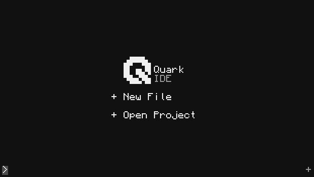
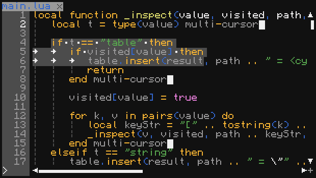
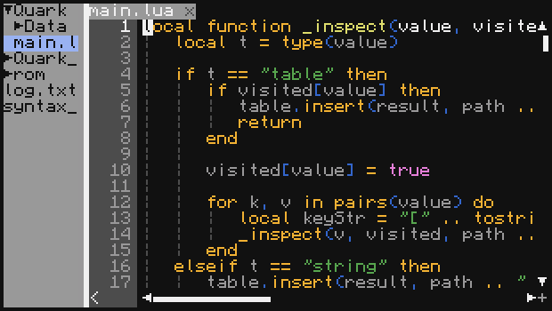
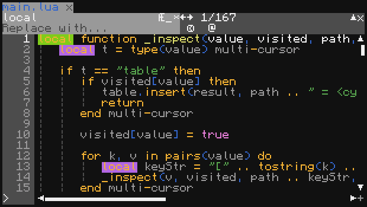
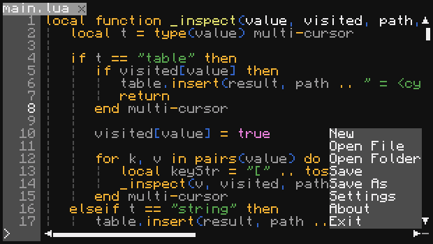

# Quark

> A modern code editor and IDE for **CC:Tweaked**.

**Quark** is a lightweight and modern IDE for developing Lua programs in CC:Tweaked.
It is designed with a focus on comfortable code editing, a clean interface, and features you would normally expect from a full-featured desktop IDE.

Quark aims to make development in CC:Tweaked more enjoyable without getting in the way of the familiar Lua workflow.

---

## ✨ Features

- 📝 **Modern code editor**

  - Multiple cursors
  - Text search
  - Selection and cursor navigation
  - Snippets
  - Comfortable editing of large files

- 📂 **Project management**

  - Project file tree
  - Multiple open files
  - Editor tabs
  - Easy project navigation

- 🔎 **Powerful search**

  - Case-sensitive search
  - Whole-word search
  - Lua pattern support

- ⚡ **Built for CC:Tweaked**

  - Runs directly inside Minecraft
  - Requires no external desktop environment
  - Works with the familiar CC:Tweaked Lua environment

---

## 🖼️ Screenshots

### Start Page



### Editor



### Project View



### Search



### Menu



---

## 🚀 Installation

Run the following command in your CC:Tweaked computer:

```lua
wget run "https://raw.githubusercontent.com/aTimmYm/Quark/refs/heads/main/installer_updater/installer.lua"
```

---

## 🎯 Why Quark?

CC:Tweaked already provides several ways to edit Lua code, but as projects grow, managing multiple files and large amounts of code becomes increasingly difficult.

Quark is built to solve this problem by combining the familiar CC:Tweaked environment with the workflow and features of a modern IDE.

---

## 📖 Status

> 🚨 **Quark is currently in development.**

Quark is an actively developed project, so some features and APIs may change over time.

---

## 🤝 Contributing

Contributions, ideas, and bug reports are welcome.

If you find a bug or have an idea for a new feature, feel free to open an **Issue** or submit a **Pull Request**.

---

<p align="center">
  Made for <strong>CC:Tweaked</strong> with ❤️
</p>
